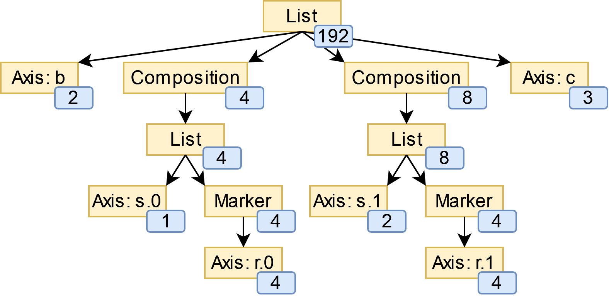

# *einx* - Tensor Operations in Einstein-Inspired Notation

einx is a Python library that allows formulating many tensor operations as concise expressions using few powerful abstractions. It is inspired by [einops](https://github.com/arogozhnikov/einops) and [einsum](https://numpy.org/doc/stable/reference/generated/numpy.einsum.html). **tl;dr**:

- Introduces [composable Einstein expressions](https://einx.readthedocs.io/en/latest/gettingstarted/overview.html#einstein-expressions) with [`[]`-notation](https://einx.readthedocs.io/en/latest/gettingstarted/overview.html#bracket-notation) that are compatible with einops-notation (see [Comparison with einops](https://einx.readthedocs.io/en/latest/faq/einops.html)).
- Integrates easily with existing code using Numpy, PyTorch, Tensorflow and Jax.
- Adds no overhead when used with just-in-time compilation like [`jax.jit`](https://jax.readthedocs.io/en/latest/jax-101/02-jitting.html) or [`torch.compile`](https://pytorch.org/tutorials/intermediate/torch_compile_tutorial.html), and marginal overhead in eager mode by caching operations (see [Performance](https://einx.readthedocs.io/en/latest/gettingstarted/overview.html#performance)).
- Uses Numpy-like naming convention: `einx.{sum|any|max|count_nonzero|where|add|logical_and|flip|...}`
- Allows inspecting the backend calls in index-based notation that are made for a given einx operation (see [Inspection](https://einx.readthedocs.io/en/latest/gettingstarted/overview.html#inspecting-operations)).
- Provides generalized neural network layers formulated in einx notation (see [Neural networks](https://einx.readthedocs.io/en/latest/gettingstarted/neuralnetworks.html)).

**Getting started:** [Go to overview and documentation](https://einx.readthedocs.io/en/latest/gettingstarted/overview.html)

:warning: **This library is currently experimental and may undergo breaking changes.** :warning:

## What does einx look like?

#### Examples: Tensor manipulation

```python
import einx
x = {np.asarray|torch.as_tensor|jnp.asarray|tf.convert_to_tensor}(...)

einx.sum("a [b]", x)                              # Sum-reduction along columns
einx.flip("([a] b)", x)                           # Reverse values along sub-axis

einx.mean("b [s...] c", x)                        # Global mean-pooling
einx.sum("b (s [s2])... c", x, s2=2)              # Sum-pooling with kernel_size=stride=2

einx.dot("b... [c1|c2]", x, w)                    # Linear layer: x * w
einx.add("b... [c]", x, b)                        # Linear layer: x + b

# Grouped linear layer
einx.dot("b... ( g  [c1|c2])", x, w) # Same weights per group
einx.dot("b... ([g c1|g c2])", x, w) # Different weights per group

einx.dot("b [s...|s2] c", x, w)                   # Spatial mixing as in MLP-mixer

einx.vmap("b [s...] c -> b c", x, op=np.mean)     # Global mean-pooling using vectorized map
einx.vmap("a [b], [b] c -> a c", x, y, op=np.dot) # Matmul using vectorized map

einx.rearrange("a, b -> (a + b)", x, y)           # Concatenate
einx.rearrange("b (q + k) -> b q, b k", x, q=2)   # Split
einx.rearrange("b c, 1 -> b (c + 1)", x, [42])    # Append number to each channel

# Layer normalization
mean = einx.mean("b... [c]", x, keepdims=True)
var = einx.var("b... [c]", x, keepdims=True)
x = (x - mean) * torch.rsqrt(var + epsilon)

# Lazy tensor construction
w = torch.nn.parameter.UninitializedParameter()
einx.dot("b... [c1|c2]", x, w, c2=32) # Calls w.materialize(shape)
```

#### Examples: Deep learning modules

```python
import einx.nn.{torch|flax|haiku} as einn

layernorm       = einn.Norm("b... [c]")
instancenorm    = einn.Norm("b [s...] c")
groupnorm       = einn.Norm("b [s...] (g [c])", g=8)
batchnorm       = einn.Norm("[b...] c", decay_rate=0.9)
rmsnorm         = einn.Norm("b... [c]", mean=False, bias=False)

channel_mix     = einn.Linear("b... [c1|c2]", c2=64)
spatial_mix1    = einn.Linear("b [s...|s2] c", s2=64)
spatial_mix2    = einn.Linear("b [s2|s...] c", s=(64, 64))
patch_embed     = einn.Linear("b (s [s2|])... [c1|c2]", s2=4, c2=64)

dropout         = einn.Dropout("[...]",       drop_rate=0.2)
spatial_dropout = einn.Dropout("[b] ... [c]", drop_rate=0.2)
droppath        = einn.Dropout("[b] ...",     drop_rate=0.2)

# See scripts/train_{torch|flax|haiku}.py for example trainings on CIFAR10
```

#### Example: Inspection

einx allows inspecting the backend calls in index-based notation that are made for a given einx operation (by passing `graph=True`). For example:

```python
>>> x = np.zeros((10, 10))
>>> graph = einx.sum("b... (g [c])", x, g=2, graph=True)
>>> print(str(graph))

Graph reduce_stage0("b... (g [c])", I0, op="sum", g=2):
    X3 := instantiate(I0, shape=(10, 10))
    X2 := reshape(X3, (10, 2, 5))
    X1 := sum(X2, axis=2)
    return X1
```

See [Inspection](https://einx.readthedocs.io/en/latest/gettingstarted/overview.html#inspecting-operations) for more details.

#### Example: Einstein expression trees

Internally, einx uses *Einstein expression trees* to represent the shapes of tensors. For example, the expression `b (s [r])... c` for a tensor with shape `(2, 4, 8, 3)` and an additional constraint `r=4` results in:



See [How does einx parse Einstein expressions?](https://einx.readthedocs.io/en/latest/faq/solver.html) for more details.

## Installation

```python
pip install git+https://github.com/fferflo/einx.git
```